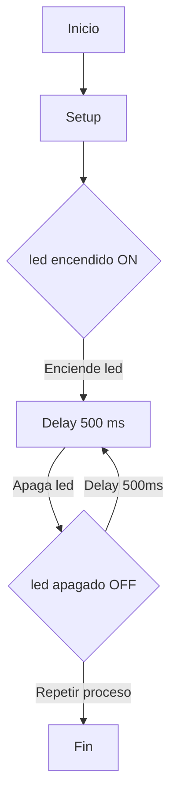
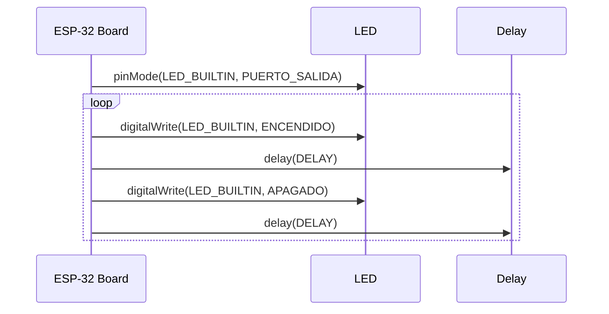

# Practica-1---PD
## **Pràctica 1 : BLINK**

**Objetivo:**
El objetivo de la practica es producir el parpadeo periodico de un led. Se utilizara la salida serie para depurar el programa.

**Materiales:**
ESP32-S1
LED (rojo)

# **Código básico**
Codigo main.cpp:
Descripcion:

```cpp
#include <Arduino.h>
#define LED_BUILTIN 48
#define DELAY 500


 void setup() {
  pinMode(LED_BUILTIN, OUTPUT);
  }
  void loop() {
  digitalWrite(LED_BUILTIN, HIGH);
  delay(DELAY);
  digitalWrite(LED_BUILTIN, LOW);
  delay(DELAY);
  }
```
# **Modificar el programa para que incluya el envio de datos (ON y OFF) al puerto serie.**
Codigo main.cpp:
```cpp
#include <Arduino.h>
#define LED_BUILTIN 48  // Pin del LED
#define DELAY 1000      // Tiempo de espera en milisegundos


void setup() {
    pinMode(LED_BUILTIN, OUTPUT);  // Configurar LED como salida
    Serial.begin(115200);          // Inicializar comunicación serie
}


void loop() {
    digitalWrite(LED_BUILTIN, HIGH);  // Encender LED
    Serial.println("ON");             // Enviar mensaje por serie
    delay(DELAY);                    


    digitalWrite(LED_BUILTIN, LOW);   // Apagar LED
    Serial.println("OFF");            // Enviar mensaje por serie
    delay(DELAY);                    
}
```


# **Modificar el programa para que actue directamente sobre los registros de los puertos de entrada y salida**
Codigo main.cpp:
```cpp
#include <Arduino.h>
#define LED_PIN 48
#define DELAY 1000


void setup() {
    // Configurar el pin como salida directamente en el hardware
    gpio_pad_select_gpio(LED_PIN);
    gpio_set_direction((gpio_num_t)LED_PIN, GPIO_MODE_OUTPUT);


    // Inicializar el puerto serie
    Serial.begin(115200);
}


void loop() {
    uint32_t *gpio_out = (uint32_t *)GPIO_OUT_REG; // Puntero al registro GPIO


    *gpio_out |= (1 << LED_PIN);  // Encender LED
    Serial.println("ON");         // Mensaje serie
    delay(DELAY);


    *gpio_out &= ~(1 << LED_PIN); // Apagar LED
    Serial.println("OFF");        // Mensaje serie
    delay(DELAY);
}
```


# **Diagramas:**

Diagrama de flujo

Diagrama de tiempo:


# **Pregunta**
**¿Cual es el tiempo libre que tiene el procesador?**
Podemos saber el tiempo libre programando un delay (#define DELAY X), los microsegundos que seleccionemos será el tiempo libre del procesador.


