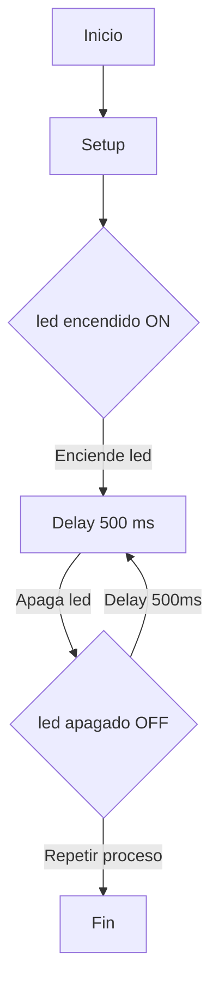
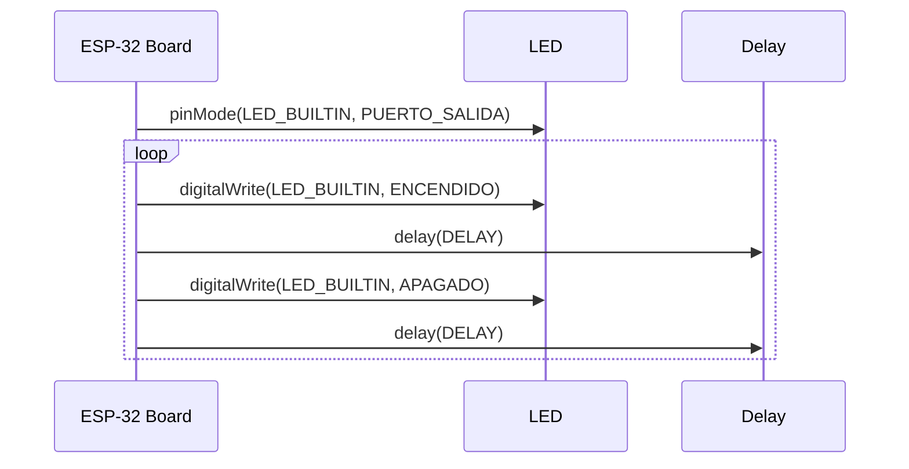

# Practica-1---PD
## **Pràctica 1 : BLINK**

**Objetivo:**
El objetivo de la practica es producir el parpadeo periodico de un led. Se utilizara la salida serie para depurar el programa.

**Materiales:**
ESP32-S1
LED (rojo)

# **Código básico**
Codigo main.cpp:
Descripcion:

# **Modificar el programa para que incluya el envio de datos (ON y OFF) al puerto serie.**
Codigo main.cpp:
Descripcion:

# **Modificar el programa para que actue directamente sobre los registros de los puertos de entrada y salida**
Codigo main.cpp:
Descripcion:

# **Diagramas:**

Diagrama de flujo

Diagrama de tiempo:

# **Pregunta**
**¿Cual es el tiempo libre que tiene el procesador?**
Podemos saber el tiempo libre programando un delay (#define DELAY X), los microsegundos que seleccionemos será el tiempo libre del procesador.

